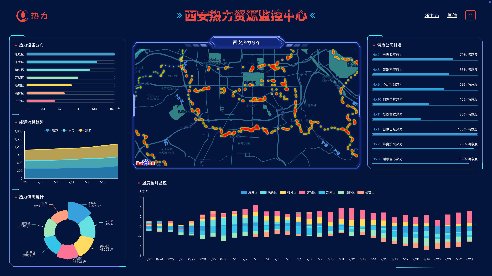
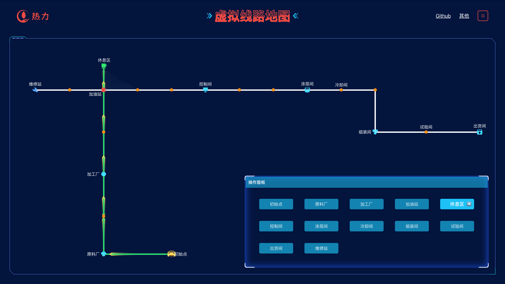

# weiz-vue3-charts

## 简介

vite5 + vue3 + ts + datav-vue3 + echarts + 百度地图 大屏展示

预览地址 https://vue3-charts.weizwz.com




**本项目数据重属虚构，请勿商用**

## 运行

安装依赖
```shell
pnpm i
```

运行
```shell
pnpm run dev
```

打包
```shell
pnpm run build
```

## 地图
由于对百度地图api加了白名单，请自行替换为你的api地址。修改根目录下的 `index.html`：
```html
<script type="text/javascript" src="https://api.map.baidu.com/api?v=3.0&ak=你的ak"></script>
```
百度地图API设置白名单后，本地仍可调用方法：
1. 假设百度白名单为 `*haha.com*`
2. 本地修改hosts文件：
  - windows文件位置 `C:\Windows\System32\drivers\etc`；
  - mac 下使用 `sudo vi /etc/hosts` 编辑，输入 i 进入编辑模式，修改完，按 `ESC` 后输入:号，然后输入 wq 回车保存。
  ```txt
  127.0.0.1         haha.com
  ```
3. 本地访问地址，使用 `haha.com:8000`，即可正常访问百度地图API

## 文档
### 1. vite+vue3 配合 echarts 使用文档
[vue3+ts打开echarts的正确方式](https://note.weizwz.com/vuejs/apply/vue3-ts-echarts)


## 升级

### ✅ 2025.07.23 主要升级内容

---

#### 🔧 核心依赖升级

| 依赖名称     | 旧版本     | 新版本     |
|--------------|------------|------------|
| Vue          | 3.3.4      | 3.5.18     |
| Vite         | 5.0.10     | 7.0.5      |
| Pinia        | 2.1.7      | 3.0.3      |
| Vue Router   | 4.2.5      | 4.5.1      |
| Axios        | 1.6.2      | 1.11.0     |
| ECharts      | 5.4.3      | 5.6.0      |

---

#### 🛠️ 开发依赖升级

| 依赖名称                 | 旧版本     | 新版本     |
|--------------------------|------------|------------|
| TypeScript               | 5.0.2      | 5.8.3      |
| ESLint                   | 8.54.0     | 9.31.0     |
| Vue TSC                  | 1.8.5      | 3.0.3      |
| @vitejs/plugin-vue       | 4.5.2      | 6.0.0      |
| Sass                     | 1.69.5     | 1.89.2     |

---

#### 🧹 解决的问题

- **移除废弃依赖**：删除了已废弃的 `node-sass` 和 `sass-loader`，现在使用现代的 `sass`
- **ESLint 配置迁移**：从旧的 `.eslintrc.cjs` 迁移到新的 `eslint.config.js` **flat config** 格式
- **TypeScript 配置优化**：修复了 `tsconfig.json` 中的文件包含问题
- **代码质量修复**：修复了所有 ESLint 警告和错误

---

#### ✅ 验证结果

- ✅ 类型检查通过：`pnpm type-check`
- ✅ 构建成功：`pnpm build`
- ✅ 代码质量检查通过：`pnpm lint`
- ✅ 开发服务器正常：`pnpm dev`