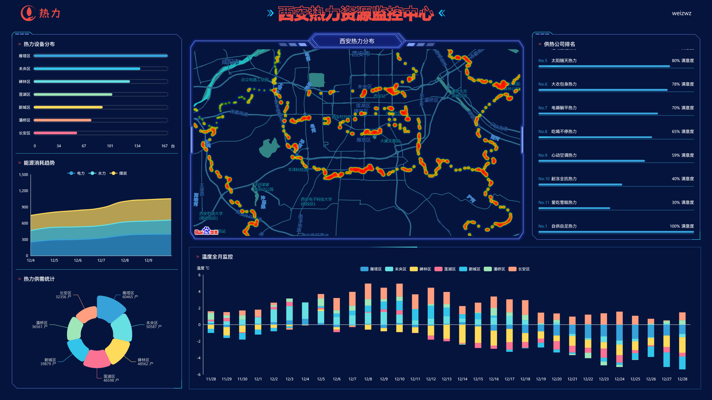

# weiz-vue3-charts

## 简介

vite5 + vue3 + ts + datav-vue3 + echarts + 百度地图 大屏展示

预览地址 https://weizwz.com/vite-vue3-charts/



**本项目数据重属虚构，请勿商用**

## 运行

安装依赖
```shell
npm i
```

运行
```shell
npm run dev
```

打包
```shell
npm run build
```

## 地图
由于对百度地图api加了白名单，请自行替换为你的api地址。修改根目录下的 `index.html`：
```html
<script type="text/javascript" src="https://api.map.baidu.com/api?v=3.0&ak=你的ak"></script>
```
百度地图API设置白名单后，本地仍可调用方法：
1. 假设百度白名单为 `*haha.com*`
2. 本地修改hosts文件，文件位置 `C:\Windows\System32\drivers\etc`
  ```txt
  127.0.0.1         haha.com
  ```
3. 本地访问地址，使用 `haha.com:8000`，即可正常访问百度地图API

## 文档
### 1. vite+vue3 配合 echarts 使用文档
[vue3+ts打开echarts的正确方式](https://weizwz.com/posts/a31b36c6.html)